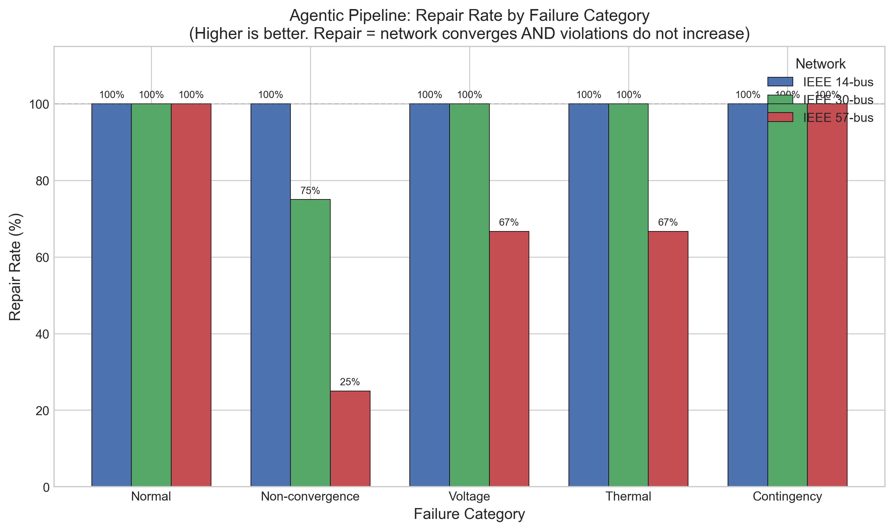
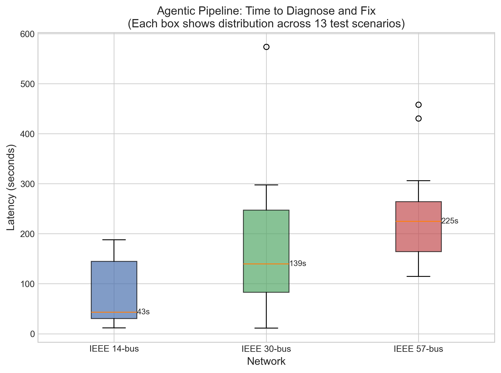
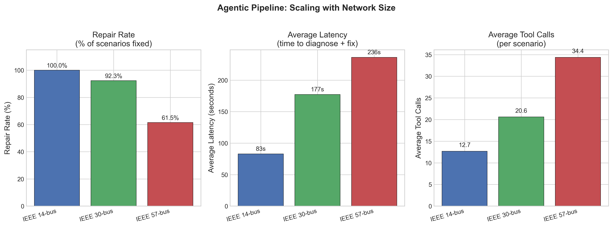
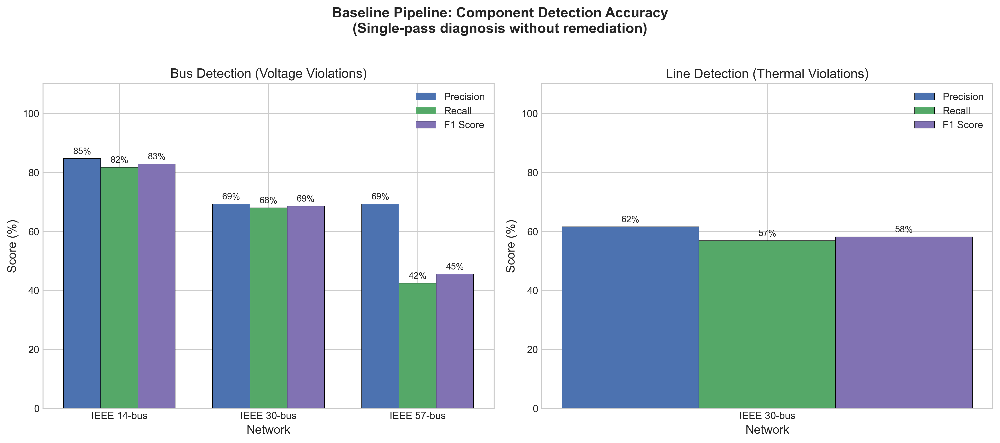
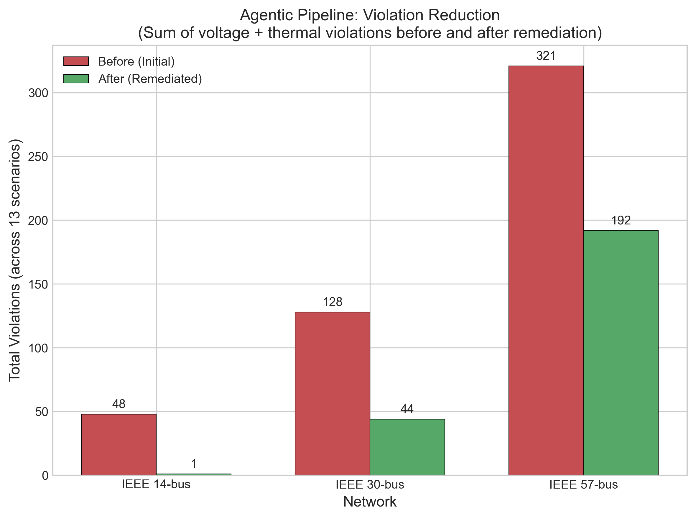

# Evaluation Results

## Experimental Setup

| Component | Description |
|-----------|-------------|
| Task | Power flow diagnosis and remediation |
| Test systems | IEEE 14-bus (14 buses, 20 lines), IEEE 30-bus (30 buses, 41 lines), IEEE 57-bus (57 buses, 80 lines) |
| Scenarios | 13 per network: 4 non-convergence, 3 voltage, 3 thermal, 2 contingency, 1 normal |
| Tools | pandapower solver, load shedding, generation redispatch, voltage setpoints |
| Model | GPT-4 |
| Voltage limits | 0.95-1.05 p.u. |
| Thermal limit | 100% loading |

## Metrics

| Metric | Definition |
|--------|------------|
| Violation | Bus voltage outside [0.95, 1.05] p.u. OR line/transformer loading >100% |
| Feasibility (%) | Power flow solver converges after remediation |
| Repair (%) | Converged AND violations_after <= violations_before |
| Violation Reduction | Initial violations -> final violations |
| ReAct Iteration | One Thought -> Action -> Observation cycle (one LLM reasoning step) |
| Tool Calls | Total tools executed across all ReAct iterations (multiple tools can run per iteration) |
| Latency (s) | Total time for diagnosis + remediation per scenario |

## Affected Components

The evaluation captures affected components at multiple levels:

| Source | Component Types | Description |
|--------|-----------------|-------------|
| Ground Truth | bus, line, trafo, load, gen, sgen | Scenario-defined root cause components |
| Violations | buses, lines, trafos | Detected symptoms (voltage/thermal violations) |
| Baseline Predictions | bus, line, load, gen, trafo, ext_grid | LLM-predicted affected components |

Ground truth and violations serve different purposes:
- **Ground truth**: Components the scenario intentionally modified (root causes)
- **Violations**: Components showing symptoms after power flow (may differ from root causes)

## Baselines

- **Baseline (single-pass)**: GPT-4 with function calling, diagnosis only, no remediation
- **Agentic (repair loop)**: GPT-4 with iterative tool use (diagnose -> act -> verify -> repeat)

---

## Results

### Main Results

| Method | Repair (%) | Feas. (%) | Violations | Avg ReAct Iters | Avg Tool Calls | Avg Latency (s) |
|--------|------------|-----------|------------|-----------------|----------------|-----------------|
| Baseline (single-pass) | N/A | N/A | N/A | N/A | 1 | 3.8 |
| Agentic (repair loop) | **84.6** | **84.6** | 497->237 | 11.5 | 22.6 | 165.5 |

### Results by Network

| Network | Scenarios | Repair (%) | Feas. (%) | Violations | Avg ReAct | Avg Tool Calls | Avg Latency (s) |
|---------|-----------|------------|-----------|------------|-----------|----------------|-----------------|
| IEEE 14-bus | 13 | 100 | 100 | 48->1 | 7.5 | 12.7 | 83.0 |
| IEEE 30-bus | 13 | 92.3 | 92.3 | 128->44 | 12.3 | 20.6 | 177.2 |
| IEEE 57-bus | 13 | 61.5 | 61.5 | 321->192 | 14.7 | 34.4 | 236.3 |
| **All** | **39** | **84.6** | **84.6** | **497->237** | **11.5** | **22.6** | **165.5** |

### Results by Category

| Category | Scenarios | Repair (%) | Avg ReAct | Avg Tool Calls |
|----------|-----------|------------|-----------|----------------|
| Non-convergence | 12 | 66.7 | 13.2 | 27.2 |
| Voltage | 9 | 88.9 | 15.4 | 28.0 |
| Thermal | 9 | 88.9 | 8.6 | 18.2 |
| Contingency | 6 | 100 | 6.7 | 12.0 |
| Normal | 3 | 100 | 11.3 | 22.0 |

### Baseline Component Detection

Measures how well the baseline (single-pass) pipeline identifies components with violations (symptom detection).

**Bus Detection (Voltage Violations)**

| Network | Precision (%) | Recall (%) | F1 (%) | Predicted | Actual |
|---------|---------------|------------|--------|-----------|--------|
| IEEE 14-bus | 84.6 | 81.7 | 82.8 | 32 | 48 |
| IEEE 30-bus | 69.2 | 67.9 | 68.5 | 6 | 69 |
| IEEE 57-bus | 69.2 | 42.4 | 45.5 | 20 | 321 |
| **Avg / Total** | **74.3** | **64.0** | **65.6** | **58** | **438** |

**Line Detection (Thermal Violations)**

| Network | Precision (%) | Recall (%) | F1 (%) | Predicted | Actual |
|---------|---------------|------------|--------|-----------|--------|
| IEEE 30-bus | 61.5 | 56.8 | 58.1 | 10 | 59 |

*Note: Only IEEE 30-bus had line violations. IEEE 14-bus and 57-bus had no thermal violations in test scenarios.*

**Trafo Detection**: No transformer violations occurred in test scenarios.

---

## Detailed Results: IEEE 14-bus

| Scenario | Category | Initial | Final | Violations | ReAct | Tool Calls | Latency (s) | Success |
|----------|----------|---------|-------|------------|-------|-------|-------------|---------|
| normal_operation | normal | Conv | Conv | 3->0 | 4 | 6 | 11.7 | Yes |
| extreme_load_scaling | nonconv | Div | Conv | 0->1 | 10 | 14 | 85.5 | Yes |
| all_generators_removed | nonconv | Conv | Conv | 8->0 | 3 | 8 | 36.0 | Yes |
| near_zero_impedance | nonconv | Div | Conv | 0->0 | 14 | 26 | 188.0 | Yes |
| disconnected_subnetwork | nonconv | Conv | Conv | 3->0 | 11 | 21 | 132.9 | Yes |
| heavy_loading_undervoltage | voltage | Conv | Conv | 7->0 | 13 | 23 | 149.2 | Yes |
| excess_generation_overvoltage | voltage | Conv | Conv | 10->0 | 13 | 20 | 163.2 | Yes |
| reactive_imbalance | voltage | Conv | Conv | 4->0 | 13 | 21 | 144.7 | Yes |
| concentrated_loading | thermal | Conv | Conv | 2->0 | 3 | 5 | 30.4 | Yes |
| reduced_thermal_limits | thermal | Conv | Conv | 3->0 | 4 | 6 | 41.9 | Yes |
| topology_redirection | thermal | Conv | Conv | 2->0 | 3 | 5 | 26.9 | Yes |
| line_contingency_overload | conting | Conv | Conv | 3->0 | 4 | 6 | 43.2 | Yes |
| trafo_contingency_voltage | conting | Conv | Conv | 3->0 | 3 | 4 | 25.2 | Yes |

## Detailed Results: IEEE 30-bus

| Scenario | Category | Initial | Final | Violations | ReAct | Tool Calls | Latency (s) | Success |
|----------|----------|---------|-------|------------|-------|-------|-------------|---------|
| normal_operation | normal | Conv | Conv | 1->0 | 4 | 5 | 11.1 | Yes |
| extreme_load_scaling | nonconv | Div | Conv | 0->6 | 21 | 28 | 247.2 | Yes |
| all_generators_removed | nonconv | Conv | Conv | 33->26 | 18 | 27 | 297.5 | Yes |
| near_zero_impedance | nonconv | Div | Div | 0->0 | 9 | 23 | 115.8 | No |
| disconnected_subnetwork | nonconv | Conv | Conv | 8->0 | 18 | 26 | 250.4 | Yes |
| heavy_loading_undervoltage | voltage | Conv | Conv | 44->2 | 15 | 22 | 182.2 | Yes |
| excess_generation_overvoltage | voltage | Conv | Conv | 14->6 | 24 | 33 | 574.0 | Yes |
| reactive_imbalance | voltage | Div | Conv | 0->1 | 10 | 28 | 139.5 | Yes |
| concentrated_loading | thermal | Conv | Conv | 20->0 | 8 | 17 | 82.9 | Yes |
| reduced_thermal_limits | thermal | Conv | Conv | 3->3 | 15 | 37 | 213.1 | Yes |
| topology_redirection | thermal | Conv | Conv | 3->0 | 9 | 11 | 89.3 | Yes |
| line_contingency_overload | conting | Conv | Conv | 1->0 | 5 | 6 | 64.6 | Yes |
| trafo_contingency_voltage | conting | Conv | Conv | 1->0 | 4 | 5 | 36.0 | Yes |

## Detailed Results: IEEE 57-bus

| Scenario | Category | Initial | Final | Violations | ReAct | Tool Calls | Latency (s) | Success |
|----------|----------|---------|-------|------------|-------|-------|-------------|---------|
| normal_operation | normal | Conv | Conv | 39->11 | 26 | 55 | 430.7 | Yes |
| extreme_load_scaling | nonconv | Div | Div | 0->0 | 9 | 42 | 127.8 | No |
| all_generators_removed | nonconv | Div | Div | 0->0 | 14 | 32 | 208.2 | No |
| near_zero_impedance | nonconv | Div | Conv | 0->0 | 18 | 50 | 306.2 | Yes |
| disconnected_subnetwork | nonconv | Conv | Div | 39->0 | 14 | 29 | 224.9 | No |
| heavy_loading_undervoltage | voltage | Div | Conv | 0->32 | 26 | 34 | 458.1 | Yes |
| excess_generation_overvoltage | voltage | Conv | Conv | 47->42 | 10 | 20 | 164.0 | Yes |
| reactive_imbalance | voltage | Div | Div | 0->0 | 15 | 51 | 239.1 | No |
| concentrated_loading | thermal | Conv | Conv | 40->13 | 7 | 25 | 114.8 | Yes |
| reduced_thermal_limits | thermal | Conv | Conv | 39->31 | 16 | 34 | 264.2 | Yes |
| topology_redirection | thermal | Conv | Div | 39->0 | 12 | 24 | 165.9 | No |
| line_contingency_overload | conting | Conv | Conv | 39->38 | 15 | 30 | 246.6 | Yes |
| trafo_contingency_voltage | conting | Conv | Conv | 39->25 | 9 | 21 | 121.0 | Yes |

---

## Latency Statistics

| Pipeline | Mean (s) | Median (s) | Min (s) | Max (s) |
|----------|----------|------------|---------|---------|
| Baseline | 3.8 | 4.0 | 1.5 | 5.7 |
| Agentic (14-bus) | 83.0 | 43.2 | 11.7 | 188.0 |
| Agentic (30-bus) | 177.2 | 139.5 | 11.1 | 574.0 |
| Agentic (57-bus) | 236.3 | 224.9 | 114.8 | 458.1 |

---

## Scalability

| Metric | 14-bus | 30-bus | 57-bus |
|--------|--------|--------|--------|
| Repair (%) | 100 | 92.3 | 61.5 |
| Avg Latency (s) | 83.0 | 177.2 | 236.3 |
| Avg ReAct Iters | 7.5 | 12.3 | 14.7 |
| Avg Tool Calls | 12.7 | 20.6 | 34.4 |

---

## Failure Analysis

**IEEE 30-bus (1 failure):**
- `near_zero_impedance`: Network divergent, agent could not restore convergence.

**IEEE 57-bus (5 failures):**
- `extreme_load_scaling`: Network divergent, agent could not restore convergence.
- `all_generators_removed`: Network divergent, agent could not restore convergence.
- `disconnected_subnetwork`: Agent actions caused previously converged network to diverge.
- `reactive_imbalance`: Network divergent, agent could not restore convergence.
- `topology_redirection`: Agent actions caused previously converged network to diverge.

**Pattern:** Larger networks have more interdependent components. Fixing one issue can create new problems elsewhere.

---

## Figures

**Figure 1: Repair Rate by Failure Category**

**Figure 2: Latency Distribution**

**Figure 3: Scaling Analysis**

**Figure 4: Baseline Component Detection**

**Figure 5: Violation Reduction**

---

## Raw Data

- `full_eval_case14.json`
- `full_eval_case30.json`
- `full_eval_case57.json`
